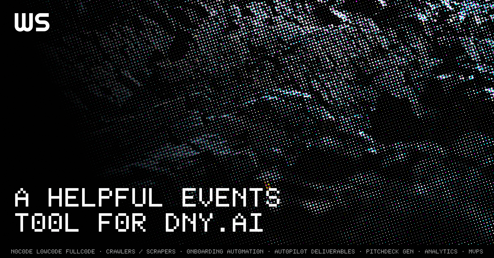

# DNY.AI Event Discovery Platform



A helpful events tool for [DNY.AI](https://dny.ai) - making AI events in Belgium accessible to everyone, regardless of language barriers.

## Why This Exists

DNY.AI hosts events across Belgium featuring AI talks, meetups, conferences, workshops, and lectures. While the original site is beautifully designed, it presents challenges for international attendees:

- **No language filtering** for English speakers
- **No map visualization** for event locations
- **No wishlist or tracking** capabilities
- **Difficult discovery** based on preferences

This platform reimagines the event discovery experience with practical functionality while leveraging the existing GraphQL API.

## Quick Start

### Prerequisites

- Node.js >= 18
- pnpm >= 9.0.0

### Installation

```bash
# Install dependencies
pnpm install

# Start development server
pnpm dev
```

Open [http://localhost:3000](http://localhost:3000) to see the app.

### Available Commands

```bash
pnpm dev          # Start development server (port 3000)
pnpm build        # Build for production
pnpm start        # Run production build
pnpm lint         # Run ESLint (max 0 warnings)
pnpm check-types  # TypeScript type checking
pnpm clean        # Clean build artifacts
```

## Key Features

### 🗺️ Interactive Maps
MapLibre-powered maps showing event locations across Belgium with geocoded coordinates.

### 🌍 Multilingual Support
Automatic Czech-to-English translation for all event data, with intelligent mapping system for handling accent variations.

### ⚡ Blazing Fast Performance
Dual-layer caching architecture (URQL + Next.js) delivers sub-100ms response times:
- Client-side URQL cache for instant navigation
- Server-side Next.js cache (5-min TTL) shared across all users
- Backend only hit once every 5 minutes per operation

### 🎯 Smart Filtering
Filter events by:
- Cities & locations
- Dates & years
- Topics & formats
- Target audiences
- Languages (English/Czech)

### 💾 Wishlist & Export
Save favorite events and export them to calendar formats (.ics).

## Tech Stack

- **Next.js 16** (App Router, React 19)
- **URQL** - GraphQL client with SSR support
- **Zustand** - State management with localStorage persistence
- **shadcn/ui** - Component library (Radix UI + Tailwind)
- **MapLibre GL** - Open-source map rendering
- **Zod** - Schema validation
- **date-fns** - Date utilities

## Architecture Highlights

### GraphQL Integration
Introspected the original DNY.AI GraphQL endpoint to pull complete event data in real-time. Proxy endpoint at `/api/graphql` handles caching and authorization.

### Translation System
AI-powered translation mapping with automatic detection:
- Manual translation dictionary with 400+ terms
- Auto-detection of missing translations in development
- Browser console helpers for debugging (`__translations`)
- Export options for batch translation via AI

### Geocoding Pipeline
Automated location mapping using OpenStreetMap Nominatim:
- Development widget for one-click geocoding
- Rate-limited API calls (1 req/sec compliance)
- Progress saving every 10 locations
- Incremental updates for missing coordinates

### Client-Side Filtering Workaround
Backend GraphQL API has incomplete filter support:
- ✅ Cities, dates, topics, formats, years - work
- ❌ Languages, targets - must filter client-side
- Solution: `useFilteredEvents()` hook applies client-side filters after fetch

## Development

This is part of a Turborepo monorepo. Key shared packages:
- `@repo/ui` - Shared React components
- `@repo/eslint-config` - Shared ESLint config
- `@repo/typescript-config` - Shared TypeScript config

### Monorepo Commands

```bash
# From monorepo root
turbo dev --filter=web
turbo build --filter=web
```

### Environment Variables

```bash
# .env.local
GRAPHQL_BACKEND_URL=https://be.dny.ai/graphql  # Optional, defaults to this
```

### Development Features

Only enabled in development (`NODE_ENV !== 'production'`):
- **Translation Collector Widget** - Orange 🌍 button for exporting missing translations
- **Missing Locations Widget** - Bottom-left widget for geocoding locations
- Console warnings for missing translations
- Development API routes in `/app/api/dev/`

## Project Structure

```
apps/web/
├── app/                    # Next.js App Router
│   ├── api/               # API routes (GraphQL proxy, translation)
│   ├── [slug]/            # Event detail pages
│   └── page.tsx           # Home page (events listing)
├── components/            # React components
│   ├── ui/               # shadcn/ui components
│   ├── events/           # Event-specific components
│   ├── wishlist/         # Wishlist features
│   └── dev/              # Development widgets
├── lib/                  # Core utilities
│   ├── graphql/          # GraphQL queries, hooks, client
│   ├── translations/     # Translation system
│   ├── locations/        # Geocoding utilities
│   ├── contexts/         # React contexts (filters)
│   ├── stores/           # Zustand stores (wishlist)
│   └── utils/            # Helper functions
└── scripts/              # Geocoding & import scripts
```

## About the Builder

Built by **Doug**, an early-stage founder/engineer consultant from Bristol, UK, now based in Prague. With a background in growth, acquisition, automation, and technical marketing, this project represents getting more involved in the local development community.

The DNY.AI festival presented the perfect "builder's problem" - a real need that could be solved with practical engineering and AI-assisted workflows. This demonstrates what's possible when you combine existing APIs with intelligent tooling.

## Contributing

Contributions welcome! This project uses:
- **pnpm** for package management (not npm/yarn)
- **ESLint** with zero warnings enforcement
- **TypeScript** strict mode
- **Conventional commits** for git messages

## License

Built for the community to make AI events accessible to everyone.

---

*A helpful events tool for DNY.AI*
